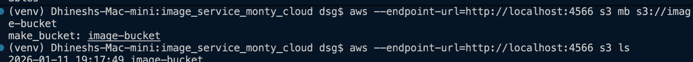
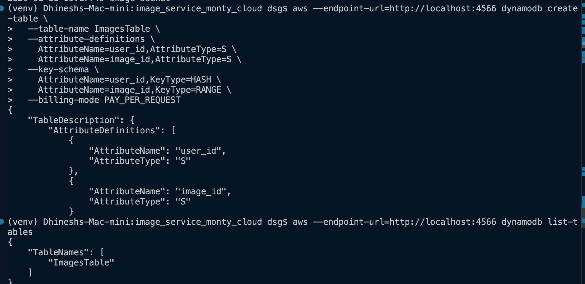
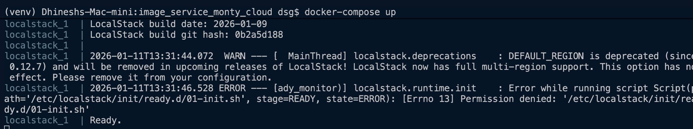
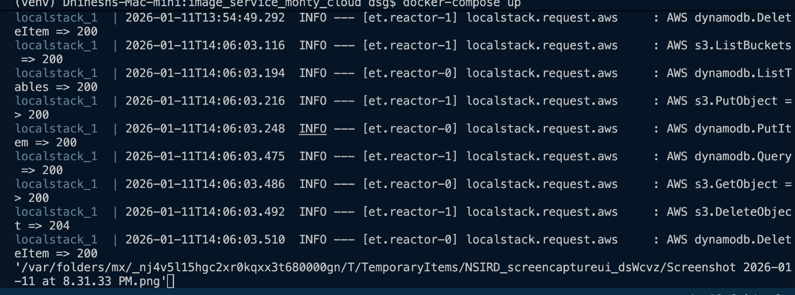
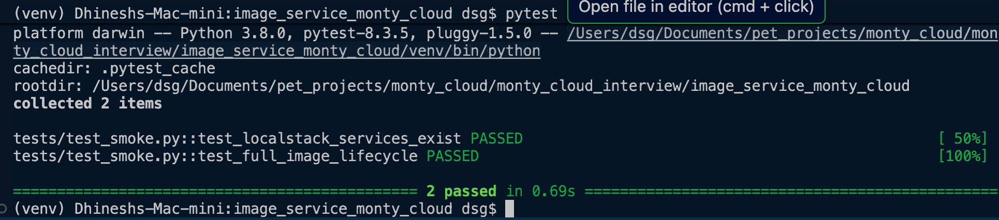

# Cloud Image Service

Serverless image upload and management service using AWS Lambda, S3, DynamoDB.
Runs fully locally using LocalStack.

## Prerequisites
- Docker + Docker Compose
- Python 3.8+
- AWS CLI


## Upload Validation & Security

The upload API enforces strict validation before persisting data:

- Only image MIME types are accepted
- Maximum file size: **5 MB**
- File signature (magic number) validation ensures content integrity
- Invalid uploads are rejected with HTTP 400

This prevents malformed or malicious files from being stored.


## Environment variables
```
export AWS_ACCESS_KEY_ID=test
export AWS_SECRET_ACCESS_KEY=test
export AWS_DEFAULT_REGION=us-east-1
export AWS_ENDPOINT=http://localhost:4566
```


## Local AWS Resource Setup (LocalStack)

Before running the application or tests, ensure the required AWS resources are available in LocalStack.

Create and verify the S3 bucket
```
aws --endpoint-url=http://localhost:4566 s3 mb s3://image-bucket
aws --endpoint-url=http://localhost:4566 s3 ls
```



Create and verify the DynamoDB table

```
aws --endpoint-url=http://localhost:4566 dynamodb create-table \
  --table-name ImagesTable \
  --attribute-definitions \
    AttributeName=user_id,AttributeType=S \
    AttributeName=image_id,AttributeType=S \
  --key-schema \
    AttributeName=user_id,KeyType=HASH \
    AttributeName=image_id,KeyType=RANGE \
  --billing-mode PAY_PER_REQUEST
aws --endpoint-url=http://localhost:4566 dynamodb list-tables
```



ℹ️ These steps are required only if the LocalStack initialization script has not already provisioned the resources.

## Run locally

```
docker-compose up
```





## Run pytest

``` 
pytest tests/test_smoke.py -v 
```



```
pytest tests/test_upload_validation.py -v
```

